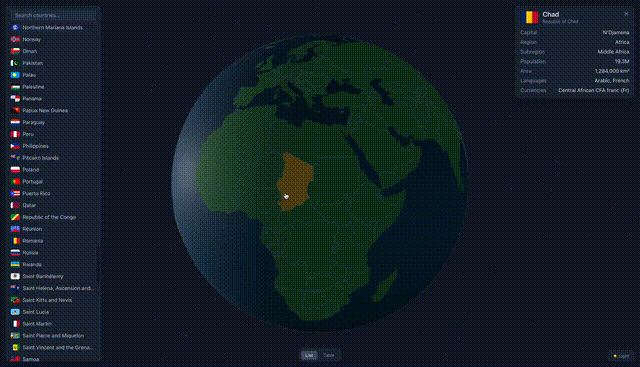

# Globe Explorer

Interactive 3D globe for exploring countries of the world. Built with React 19, Three.js r183 (WebGPURenderer), and three-kvy-core.

**[Live Demo](https://globe-lilac-xi.vercel.app/)**



## Features

### Core (Level 0)

- 3D globe with ocean, country polygons, atmosphere glow, and starfield
- Camera orbit navigation (mouse drag, scroll zoom, touch rotate/pinch)
- Click any country on the globe to select it
- Detailed country info panel (flag, capital, population, area, languages, currencies)
- Data fetched dynamically from [restcountries.com](https://restcountries.com)
- Full mobile and tablet support with responsive layout

### Country List (Level 1)

- Searchable country list with real-time filtering
- Bidirectional sync: list hover/select updates globe, globe click updates list

### Table & Virtualization (Level 2)

- Sortable, filterable table powered by @tanstack/react-table
- Region dropdown filter (base-ui Select)
- Virtualized scroll via @tanstack/react-virtual (overscan 10)
- List/Table view toggle (base-ui Tabs)

### Bonus

- Hover/select color animations via tween.js
- Light/dark theme toggle with scene background transition
- Real-time sun position based on UTC (day/night terminator matches actual time)
- Point markers for micro-states without polygon data (Vatican, Monaco, etc.)
- Area-based camera zoom on country selection (small countries = closer zoom)

## Technical Decisions

### Globe Geometry Pipeline

Country polygons are built from [Natural Earth 110m](https://github.com/topojson/world-atlas) TopoJSON data:

1. **TopoJSON to GeoJSON** — `topojson-client` converts topology to feature collection
2. **Local-plane triangulation** — vertices are projected onto a local 2D plane around the polygon's spherical center (not raw lon/lat), then triangulated with [earcut](https://github.com/mapbox/earcut). This handles antimeridian crossings and polar regions without special cases
3. **Spherical subdivision** — post-earcut triangles are subdivided on the sphere surface (depth 2-3) to prevent large flat triangles from "sinking" below the ocean
4. **Winding normalization** — inverted triangles are flipped for correct FrontSide culling
5. **Z-fighting prevention** — country meshes sit at `R + 0.01` with `polygonOffset`, ocean at `R`

### TSL Shaders

All shaders use Three.js Shading Language (TSL) — composable node-based shaders that compile to WGSL (WebGPU) or GLSL ES 3.0 (WebGL2) automatically.

- **Ocean shader** (`oceanShader.ts`) — depth/latitude color gradient (deep, shallow, polar), sun-facing day/twilight tinting, specular glint from camera-relative half-vector
- **Country shader** (`countryShader.ts`) — base color with uniform-driven hover/select blending (green → light green → gold), same day/twilight lighting as ocean
- **Atmosphere shader** (`atmosphereShader.ts`) — Fresnel rim glow on a slightly larger BackSide sphere with additive blending
- **Sun direction** (`sunUniform.ts`) — shared uniform updated each frame from UTC. Solar declination from day-of-year, hour angle from UTC hours. The same direction drives both TSL shaders and the DirectionalLight

### ISO Code Matching

World-atlas uses ISO 3166-1 numeric IDs, restcountries uses alpha-3 (cca3). Bridge built via `ccn3` field from restcountries, with case-insensitive name fallback for countries without numeric codes.

### Camera System

- **camera-controls** for orbit navigation with smooth transitions
- **Focal offset** shifts the visible center when panels are open (table view, tablet list), recalculated on resize and zoom
- **Area-based flyTo** — camera distance computed from country area on a log scale (Vatican → distance 9, Russia → distance 15)
- **Safari trackpad** — gesture events intercepted to prevent conflicts with wheel-based dolly

### Architecture

All Three.js logic lives in `src/three/` via three-kvy-core patterns:

- **Features** (Object3DFeature): GlobeFeature, CountriesFeature, AtmosphereFeature, StarfieldFeature, CountryMeshFeature
- **Modules** (CoreContextModule): CameraModule, RaycastModule, CountryStateModule, TweenModule

React layer (`src/components/`, `src/hooks/`) has zero Three.js imports. Communication via eventemitter3 events and React context.

## Tech Stack

| Category  | Technology                                        |
| --------- | ------------------------------------------------- |
| Build     | Vite 6, TypeScript                                |
| UI        | React 19.2+, Tailwind CSS v4, @base-ui/react      |
| 3D        | Three.js r183 + WebGPURenderer, three-kvy-core    |
| Shaders   | TSL (Three.js Shading Language)                   |
| Animation | tween.js, camera-controls                         |
| Data      | @tanstack/react-query, restcountries.com API      |
| Table     | @tanstack/react-table, @tanstack/react-virtual    |
| Utilities | clsx + tailwind-merge, eventemitter3              |
| Lint      | @tanstack/eslint-config, @shopify/prettier-config |
| Test      | Vitest, Testing Library                           |

## Requirements

- Node.js >= 20.11.0
- npm >= 10.2.4

## Setup

```bash
npm install
```

## Scripts

```bash
npm run dev        # Start development server
npm run build      # Type-check and build for production
npm run lint       # Run ESLint
npm run format     # Format code with Prettier
npm run test       # Run tests
npm run test:watch # Run tests in watch mode
npm run preview    # Preview production build
```
